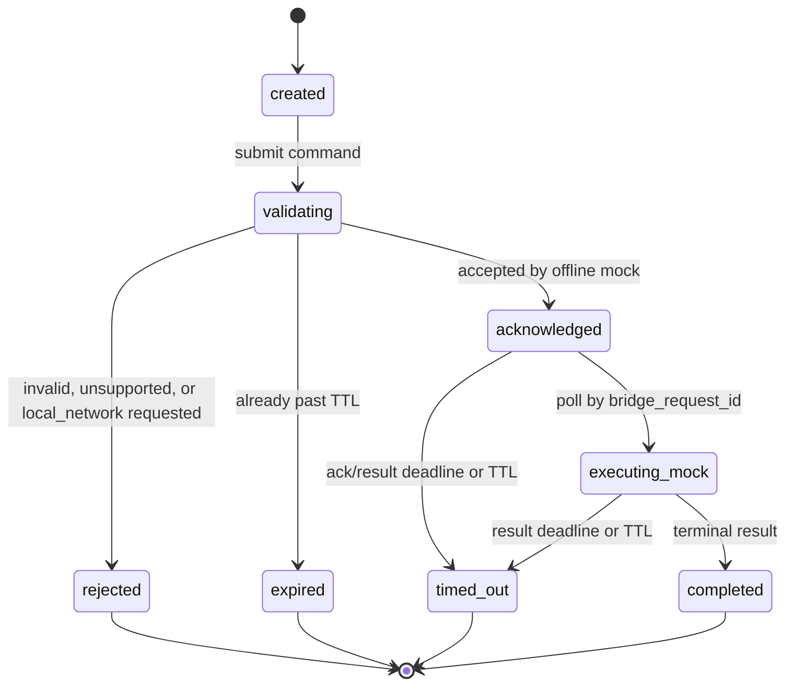

# App-to-Bridge Contract v0.1

Status: defined and locally implemented in Python as an offline mock. Swift is
still a typed mock seam; no live transport or App-to-device adapter exists.

Protocol version: `pac.app_bridge.v0.1`.

## Purpose And Boundary

This contract defines the application-to-bridge envelope used by the iOS
companion's typed bridge seam. It makes mock behavior deterministic while
reserving a future transport integration behind a separate repair gate.

This contract does not define an HTTP route, a socket, a queue, credentials,
an endpoint, a device action, or a live transport. It does not authorize any
of them.

The current executable mode is `offline_mock` only. A request that asks for
`local_network` is rejected before dispatch, with no transport attempt. A live
adapter may be designed or implemented only in a future bounded L3 task after
the user explicitly says `进入修复阶段`; this document is not that approval.

## Source Boundaries

| Layer | Protocol or source | Relation to this contract |
| --- | --- | --- |
| App to Bridge | `pac.app_bridge.v0.1` | This document. It normalizes iOS intent and mock results. |
| Bridge to StackChan device | `stackchan.command.v0.1` | Separate historical command/event protocol. Its device acknowledgement is not this contract's app acknowledgement. |
| Offline DTO acceptance | `stackchan.wire.v0.2` | Separate strict DTO/canonical-JSON contract. It is not an iOS or LAN transport. |
| Current iOS seam | `LANBridgeClient`, `MockLANBridgeClient`, `AppBridgeClientFactory` | Current calls remain Swift-local `send -> request_id -> pollResult`; they do not invoke the Python dispatcher. |
| Current Python contract | `src/personal_ai_companion/app_bridge/contract.py`, `mock.py` | Immutable DTO validation and deterministic `OfflineMockDispatcher`; no route or device dependency. |
| Current fixtures/tests | `fixtures/app-bridge/v0.1/`, `tests/test_app_bridge_contract.py` | Fixed canonical fixtures cover ack/result, timeout, expiry, dedupe/conflict, fallback, and live-transport rejection. |

No field in this document proves interoperability with either StackChan
contract. A future adapter must be separately specified and gated.

## Non-Negotiable Invariants

1. `MockLANBridgeClient` remains the iOS default and only iOS dispatcher. The
   separate Python `OfflineMockDispatcher` is local-only and has no route.
2. Every current `AppIntegrationModeID` resolves to `offline_mock` execution.
3. `live_candidate` is an integration-readiness label, not permission to use a
   local network transport.
4. An acknowledgement confirms validation and mock acceptance only. It does
   not claim a physical device acknowledgement, device execution, or user
   visible success.
5. A terminal `result` or `error` is required for every accepted command before
   its TTL ends. Expiration is terminal.
6. Public errors contain only fixed safe categories. They never include an
   address, credential material, raw exception, request body, health data, or
   device detail.
7. Fallback is explicit. A result executed by mock must identify itself as
   mock; it must never be presented as a live result.

## Identity And Time

The following IDs are deliberately distinct.

| Field | Format and owner | Meaning | Current Swift mapping |
| --- | --- | --- | --- |
| `command_id` | Lowercase UUID, application-owned | Stable logical command identity. Reused only for the same logical command. | `StackChanCommandEnvelope.id.uuidString.lowercased()` |
| `idempotency_key` | Lowercase UUID, application-owned | Stable retry/deduplication identity for one immutable submission. | `LANBridgeSendRequest.clientRequestID.uuidString.lowercased()` |
| `bridge_request_id` | Opaque bridge-owned string | Correlates accepted work with result polling. | `LANBridgeSendResponse.requestID.rawValue` and `LANBridgePollRequest.requestID` |
| `result_id` | Not defined by this contract | A future bridge/device result identifier, if needed. | Do not substitute `BridgeRequestID` or the v0.2 `result_id`. |

`command_id`, `idempotency_key`, and `bridge_request_id` MUST NOT be copied
into one another or treated as aliases. The Python offline implementation now
enforces the v0.1 idempotency, TTL, capability, app-ack, result, and identity
tombstone rules. The Swift mock still exposes its earlier typed request-id/poll
shape and is not yet a cross-language implementation of this envelope.

Time is represented as integer UTC epoch milliseconds. `ttl_ms` is canonical;
`expires_at_ms` MUST equal `created_at_ms + ttl_ms`. The accepted range is
`1_000` through `30_000` milliseconds, intentionally aligned with the offline
v0.2 DTO range without claiming wire compatibility. The bridge is the clock
authority for acceptance and expiry decisions.

## Command Envelope

Every command is a JSON object with `message_kind: "command"` and the exact
`protocol_version` value `pac.app_bridge.v0.1`.

| Field | Type | Required | Rules |
| --- | --- | --- | --- |
| `protocol_version` | string | yes | Exact value `pac.app_bridge.v0.1`. |
| `message_kind` | string | yes | Exact value `command`. |
| `command_id` | UUID string | yes | Lowercase canonical UUID; stable for the logical command. |
| `idempotency_key` | UUID string | yes | Lowercase canonical UUID; stable across a retry of the same immutable command. |
| `producer` | string | yes | Exact v0.1 value `ios_companion`; scopes idempotency without carrying a user identity. |
| `integration_mode` | enum | yes | One of `mock_only`, `configured_offline`, `live_candidate`, `fallback_to_mock`. |
| `requested_execution_mode` | enum | yes | `offline_mock` is the only accepted v0.1 value. `local_network` is reserved and rejected before dispatch. |
| `capability` | enum | yes | One v0.1 capability from the table below. |
| `created_at_ms` | integer | yes | Sender creation time in the JSON safe-integer range. |
| `ttl_ms` | integer | yes | `1_000..30_000`; canonical command lifetime. |
| `expires_at_ms` | integer | yes | Exactly `created_at_ms + ttl_ms`. |
| `ack_timeout_ms` | integer | yes | `1_000..min(5_000, ttl_ms)`; wait limit for an acknowledgement. |
| `result_timeout_ms` | integer | yes | `ack_timeout_ms..ttl_ms`; wait limit for a terminal result. |
| `scope` | string | yes | Existing `PrivacyScope` raw value; no raw health or private memory payload may be added by this contract. |
| `delivery_mode` | enum | yes | Existing `DeliveryMode`: `screen`, `speaker`, `notification`, or `api`. |
| `requires_owner_confirmation` | boolean | yes | Preserved from the typed command seam. |
| `dry_run` | boolean | yes | Preserved from `LANBridgeSendRequest`. It changes mock result status, not transport policy. |
| `payload` | object | yes | Capability-specific, non-secret, and synthetically fixtureable. |
| `extensions` | object | yes | Empty in v0.1 fixtures. Only `x_` extension keys are allowed for a future additive change. |

### Capability Matrix

| Capability | Payload shape | Existing Swift intent | v0.1 mock behavior |
| --- | --- | --- | --- |
| `chat.send` | `{ "text": "..." }` | `StackChanCommandKind.chat` | Deterministic synthetic reply; never sends a network request. |
| `bridge.health.check` | `{}` | `LANBridgeHealthRequest` | Deterministic `BridgeHealth`-shaped mock status. |
| `device.expression.preview` | `{ "pattern": "..." }` | `StackChanCommandKind.expression` | Local preview acknowledgement only; no physical display action. |
| `device.motion.preview` | `{ "action": "..." }` | `StackChanCommandKind.motion` | Local preview acknowledgement only; no physical motion. |
| `device.camera_capture.preview` | `{ "resolution": "low" }` | `StackChanCommandKind.cameraCapture` | Synthetic receipt only; no image, media bytes, URL, or capture. |

`displayText`, `speakText`, direct device `status`, and all unspecified values
are not v0.1 App-to-Bridge capabilities. They return
`capability_not_available` with a safe `unavailable` public error. Future
device capabilities require their own contract and L3 scope.

## Integration And Execution Modes

`integration_mode` carries the existing app readiness state. It does not select
a transport by itself.

| Integration mode | Required v0.1 execution mode | Resolution | Notes |
| --- | --- | --- | --- |
| `mock_only` | `offline_mock` | `mock_only` | Default app state and normal deterministic mock execution. |
| `configured_offline` | `offline_mock` | `configured_offline` | Configuration intent exists, but execution remains mock-only. |
| `live_candidate` | `offline_mock` | `live_candidate_gated` | Future readiness label only. No explicit seam or transport may be selected by this contract. |
| `fallback_to_mock` | `offline_mock` | `fallback_to_mock` | Mock result carries the fixed fallback marker for user-visible state. |

`requested_execution_mode: "local_network"` MUST return a terminal error with
all of the following properties:

- `error_code: "live_transport_not_authorized"`
- `public_error.kind: "unavailable"`
- `transport_attempted: false`
- no automatic replay, no address lookup, and no credential or endpoint access

This is a rejection, not a successful fallback. The caller may later submit a
new `offline_mock` command only after choosing mock mode locally. It must use a
new `command_id` and a new `idempotency_key`, linked by a safe
`fallback_of_command_id` extension only if a future implementation needs the
relationship.

## Idempotency And Expiry

The bridge deduplication key is `(producer, idempotency_key)`, where the v0.1
producer is the fixed non-user identifier `ios_companion`. It is retained only
in memory until the command TTL expires. No v0.1 persistence is required or
permitted by this contract.

1. The first valid command records its immutable fingerprint: capability,
   command ID, integration mode, requested execution mode, scope, delivery
   mode, confirmation flag, dry-run flag, TTL, and canonical payload.
2. The same key and the same fingerprint received before expiry returns the
   original acknowledgement or terminal envelope. It MUST NOT execute twice.
3. The same key with a different fingerprint returns
   `idempotency_conflict`; it does not replace the original record.
4. The same `command_id` with a different idempotency key also returns
   `idempotency_conflict`.
5. On or after `expires_at_ms`, the original command is terminally expired and
   its dedupe record may be removed. A later intent must use fresh IDs.
6. A mock fixture may simulate timeout deterministically, but it MUST NOT
   create a network delay, timer-driven transport, or device action.

## Response Envelopes

All responses echo `protocol_version`, `command_id`, and the effective mode.
They contain only safe, typed status information.

### Acknowledgement

`message_kind: "ack"` means the bridge validated and accepted a command for
mock processing. It is not a StackChan device acknowledgement and does not
mean the command completed.

| Field | Type | Required | Rules |
| --- | --- | --- | --- |
| `message_kind` | string | yes | Exact value `ack`. |
| `accepted` | boolean | yes | `true` only after validation and mock acceptance. |
| `status` | string | yes | `queued_mock`, `dry_run`, or `duplicate`. |
| `bridge_request_id` | string | yes when accepted | Opaque result-poll correlation ID. |
| `effective_execution_mode` | enum | yes | Always `offline_mock` in v0.1. |
| `mode_resolution` | enum | yes | Values from the integration-mode table. |
| `is_mocked` | boolean | yes | Always `true` in v0.1. |
| `expires_at_ms` | integer | yes | Echoes accepted expiry. |

### Result

`message_kind: "result"` is terminal success or safe partial completion. It
is returned through the existing poll correlation model after the app has an
acknowledgement. A result cannot follow a terminal error.

| Field | Type | Required | Rules |
| --- | --- | --- | --- |
| `message_kind` | string | yes | Exact value `result`. |
| `status` | string | yes | `done` or `partial`. |
| `bridge_request_id` | string | yes | Matches the accepted acknowledgement. |
| `effective_execution_mode` | enum | yes | Always `offline_mock` in v0.1. |
| `mode_resolution` | enum | yes | Shows whether mock was normal, gated, or fallback-selected. |
| `is_mocked` | boolean | yes | Always `true` in v0.1. |
| `result` | object | yes | Capability-specific safe result. It never contains raw media, endpoint data, or sensitive context. |
| `reply_truncated` | boolean | conditional | Required for `chat.send`; maps to `StackChanBridgeResult.replyTruncated`. |
| `public_notice` | object | conditional | Required when `mode_resolution` is `fallback_to_mock`; kind is `fallback_to_mock`. |

### Error

`message_kind: "error"` is terminal. It may be returned before an ack for a
validation rejection, or after an ack for expiry/timeout. It must not include a
raw implementation error.

| Field | Type | Required | Rules |
| --- | --- | --- | --- |
| `message_kind` | string | yes | Exact value `error`. |
| `terminal_state` | enum | yes | `rejected`, `expired`, or `timed_out`. |
| `error_code` | string | yes | Stable protocol code from the table below. |
| `public_error` | object | yes | Fixed safe kind, title, and recovery action only. |
| `retryable` | boolean | yes | Does not imply automatic replay. |
| `transport_attempted` | boolean | yes | Always `false` in v0.1. |
| `fallback` | object | yes | Explicit `none` or `submit_new_offline_mock_command`; never silently replays. |

### Public Error Mapping

The `public_error.kind` value MUST map to the existing
`CompanionPublicErrorKind` values. The iOS presentation is owned by
`AppPublicErrorCatalog`; this protocol supplies a category, not raw UI text.

| Error code | Public error kind | Safe user-visible meaning |
| --- | --- | --- |
| `command_expired`, `ack_timeout`, `result_timeout` | `timeout` | The mock operation did not finish in its allotted time. |
| `confirmation_required` | `unauthorized` | Owner confirmation is needed before continuing. |
| `live_transport_not_authorized`, `capability_not_available` | `unavailable` | The requested operation is unavailable in the current mock-only phase. |
| `invalid_envelope`, `idempotency_conflict`, `unsupported_protocol_version` | `malformed_response` | The local mock contract input or response is not usable. |
| `mock_fallback_active` | `fallback_to_mock` | The app is explicitly continuing with deterministic offline mock behavior. |

The bridge MAY keep an internal diagnostic reference outside this contract, but
it MUST NOT include it in a public envelope, fixture snapshot, or UI state.

## Timeout And Fallback Rules

- No acknowledgement by `ack_timeout_ms` produces terminal
  `ack_timeout`. The app MUST NOT claim that the command was delivered.
- An acknowledgement without a terminal result by `result_timeout_ms` or TTL
  produces terminal `result_timeout`. The app MUST NOT infer completion.
- An expired command produces `command_expired`, even when a duplicate is
  received after expiry.
- Retrying an app command reuses its `idempotency_key` only when the immutable
  fingerprint is identical and it has not expired.
- Fallback is never implicit. If a future authorized live attempt fails before
  acceptance, the app may create a new mock command with new IDs and an
  explicit fallback marker. If it fails after acknowledgement, the original
  command remains unknown or failed; it MUST NOT be silently replayed or shown
  as successful.
- A mock fallback failure remains a mock error. It never re-enters a future
  live path.

## State Machine



The `acknowledged` state is App-to-Bridge acceptance. It is intentionally not
the `ack` event defined by `stackchan.command.v0.1`. A fallback is a new,
explicit command submission, not an arrow from an in-flight command to
`executing_mock`.

## JSON Examples

### Mock Chat Command

```json
{
  "protocol_version": "pac.app_bridge.v0.1",
  "message_kind": "command",
  "command_id": "00000000-0000-4000-8000-000000000202",
  "idempotency_key": "00000000-0000-4000-8000-000000000101",
  "producer": "ios_companion",
  "integration_mode": "mock_only",
  "requested_execution_mode": "offline_mock",
  "capability": "chat.send",
  "created_at_ms": 1777777777000,
  "ttl_ms": 10000,
  "expires_at_ms": 1777777787000,
  "ack_timeout_ms": 2000,
  "result_timeout_ms": 10000,
  "scope": "owner_private",
  "delivery_mode": "screen",
  "requires_owner_confirmation": false,
  "dry_run": true,
  "payload": {
    "text": "contract fixture hello"
  },
  "extensions": {}
}
```

### Mock Acknowledgement

```json
{
  "protocol_version": "pac.app_bridge.v0.1",
  "message_kind": "ack",
  "command_id": "00000000-0000-4000-8000-000000000202",
  "accepted": true,
  "status": "dry_run",
  "bridge_request_id": "mock_req_contract_0001",
  "effective_execution_mode": "offline_mock",
  "mode_resolution": "mock_only",
  "is_mocked": true,
  "expires_at_ms": 1777777787000
}
```

### Mock Result

```json
{
  "protocol_version": "pac.app_bridge.v0.1",
  "message_kind": "result",
  "command_id": "00000000-0000-4000-8000-000000000202",
  "bridge_request_id": "mock_req_contract_0001",
  "status": "done",
  "effective_execution_mode": "offline_mock",
  "mode_resolution": "mock_only",
  "is_mocked": true,
  "result": {
    "reply": "Mock StackChan reply. No LAN request was made."
  },
  "reply_truncated": false
}
```

### Rejected Live Transport Request

```json
{
  "protocol_version": "pac.app_bridge.v0.1",
  "message_kind": "error",
  "command_id": "00000000-0000-4000-8000-000000000303",
  "terminal_state": "rejected",
  "error_code": "live_transport_not_authorized",
  "public_error": {
    "kind": "unavailable",
    "title": "Current unavailable",
    "recovery": "Use offline mock mode."
  },
  "retryable": false,
  "transport_attempted": false,
  "fallback": {
    "action": "submit_new_offline_mock_command",
    "automatic": false
  }
}
```

## Swift Mapping Recommendation

This is a design mapping only. It does not require or authorize a Swift edit.

| Contract concept | Existing Swift source | Recommendation |
| --- | --- | --- |
| `integration_mode` | `AppIntegrationModeID` | Encode its raw value verbatim. Factory selection still remains mock fallback. |
| `requested_execution_mode` | `LANBridgeTransportMode` | Emit `offline_mock` in v0.1. Do not construct `localNetwork` through this contract. |
| `command_id` | `StackChanCommandEnvelope.id` | Encode the UUID in lowercase canonical form. |
| `idempotency_key` | `LANBridgeSendRequest.clientRequestID` | Retain the UUID for a retry of the same immutable command; do not confuse it with `command_id`. |
| `capability` | `StackChanCommandKind` | Map only the capability matrix above. Unsupported kinds fail locally with a safe public category. |
| `scope`, `delivery_mode`, confirmation | `StackChanCommandEnvelope` and `InteractionEnvelope` | Preserve existing raw values without serializing health or other sensitive context into this contract. |
| acknowledgement | `LANBridgeSendResponse` | Map `requestID` to `bridge_request_id`, `status` to ack status, and `isMocked` to `is_mocked`. |
| result | `StackChanBridgeResult` | Map `status`, `reply`, and `replyTruncated` to terminal result fields. |
| public error | `CompanionPublicError` and `AppPublicErrorCatalog` | Map only the five existing public kinds; do not expose underlying error text. |

The existing explicit `LANBridgeClient` injection seam remains test/future-gated
only. It is not an exception to the v0.1 mock-only rule.

## Current Python Mapping

The local product source implements the previously recommended Python slice:

1. `contract.py` defines immutable command, acknowledgement, result, error, and
   public-error shapes separately from the StackChan device protocols.
2. Validation covers protocol version, exact fields, canonical UUIDs, TTL
   arithmetic, capabilities, modes, and immutable idempotency fingerprints.
3. `OfflineMockDispatcher` returns deterministic acknowledgement and terminal
   envelopes without opening a route, queue, socket, endpoint, or device path.
4. In-memory idempotency replay records expire by TTL. Separate command-identity
   tombstones prevent unsafe ID reuse for the lifetime of the dispatcher; they
   are not currently TTL-pruned. Retained state excludes credentials, user data,
   and media.
5. The implementation deliberately does not adapt to
   `stackchan.command.v0.1` or `stackchan.wire.v0.2`. That remains a future L3
   bridge slice with separate ID mapping, privacy review, and rollback.

## Mock Fixture Corpus

The fixed local-only fixture corpus now exists at
`fixtures/app-bridge/v0.1/` and is consumed by the Python contract tests. Swift
does not yet consume this exact App-bridge corpus.

| Fixture | Expected assertion |
| --- | --- |
| `chat_mock_happy_path` | Command, acknowledgement, and result use fixed IDs/timestamps; `is_mocked` is true and no transport is attempted. |
| `dry_run_receipt` | `dry_run: true` returns `status: dry_run` with a terminal mock result. |
| `duplicate_replay` | Same valid idempotency key and immutable payload returns the original bridge request ID and does not execute twice. |
| `idempotency_conflict` | Same key with a changed immutable field returns terminal `idempotency_conflict` and `malformed_response`. |
| `expired_command` | Expired or invalid TTL command returns `command_expired` and `timeout`; no acknowledgement is emitted. |
| `result_timeout` | Fixture-injected mock delay exceeds result deadline and returns `result_timeout`; no live retry occurs. |
| `unsupported_capability` | Unsupported kind returns `capability_not_available` and `unavailable`. |
| `live_transport_no_go` | `requested_execution_mode: local_network` returns `live_transport_not_authorized`, `transport_attempted: false`, and no automatic fallback. |
| `fallback_marker_mock` | `integration_mode: fallback_to_mock` with `offline_mock` emits a mock result with `public_notice.kind: fallback_to_mock`. |

All fixtures should use fixed synthetic UUIDs and timestamps. They must be
canonical JSON round trips and must pass the existing mock-safety expectation:
no credential-like terms, no endpoint/address, no raw exceptions, and no real
user, health, media, or device data.

## Compatibility And Migration Rules

1. The v0.1 core is closed: required fields and enum meanings MUST NOT be
   renamed, removed, or repurposed. Unknown top-level core fields are rejected.
2. Additive experimentation belongs only inside `extensions` keys prefixed
   `x_`. A receiver may ignore an unknown `x_` key, but it must not change
   execution, safety, TTL, idempotency, or public-error behavior.
3. A documentation clarification that does not change JSON is `v0.1.x` and
   needs no migration. Any new required field, changed field type, changed
   enum meaning, or changed state transition requires a new protocol version.
4. Successful responses echo `pac.app_bridge.v0.1`. For an unsupported request
   version, the error response uses `protocol_version: "pac.app_bridge.v0.1"`
   and adds `received_protocol_version` with the non-sensitive request value;
   its code is `unsupported_protocol_version` and its public category remains
   `malformed_response`.
5. The current `send -> bridge_request_id -> pollResult` flow is wrapped by
   this envelope; it is not removed or replaced by a flag-day migration.
6. A future bridge-to-device adapter must create and track its own device
   `command_id` and, if needed, a device `result_id`. It MUST NOT claim that
   the app command UUID is automatically compatible with `cmd_` or `res_`
   identifiers in `stackchan.wire.v0.2`.
7. A protocol version change never authorizes live transport. The future L3
   gate, bounded repair plan, explicit rollback path, mock fallback regression
   coverage, and safe user-error verification remain mandatory.

## Acceptance Checklist

- [x] Documents `command_id`, capability, modes, TTL, idempotency, ack/result/error, timeout, fallback, and user-visible errors.
- [x] Keeps App-to-Bridge, Bridge-to-device, and offline DTO contracts distinct.
- [x] Implements deterministic Python DTO, mock dispatcher, fixtures, and local tests.
- [x] Maps the contract to the current Swift seam without claiming Swift/Python parity.
- [x] States that v0.1 permits mock only and that all live transport remains behind a future explicit L3 gate.
- [x] Contains no endpoint, credential, real data, network command, device action, or deployment instruction.
